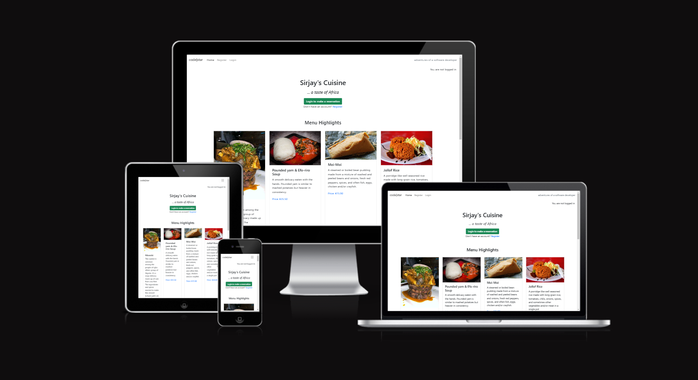
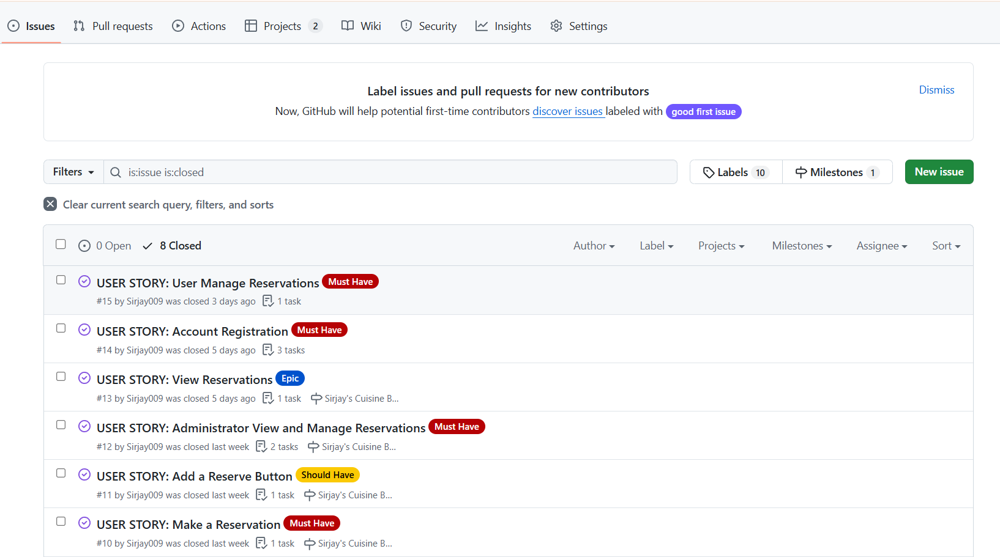
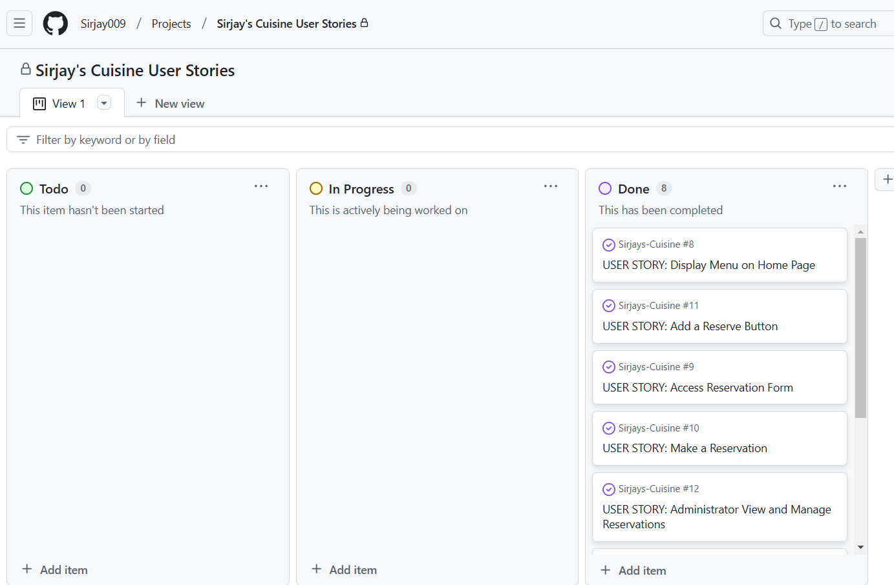
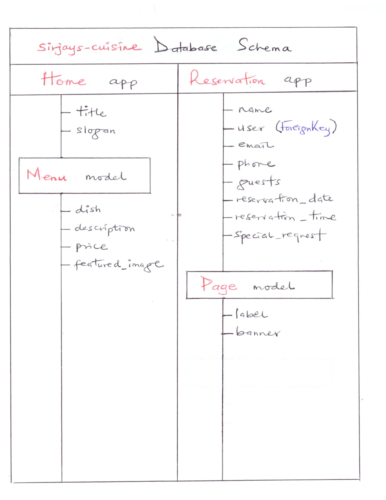
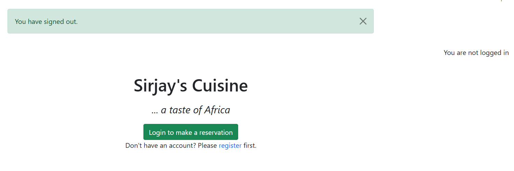
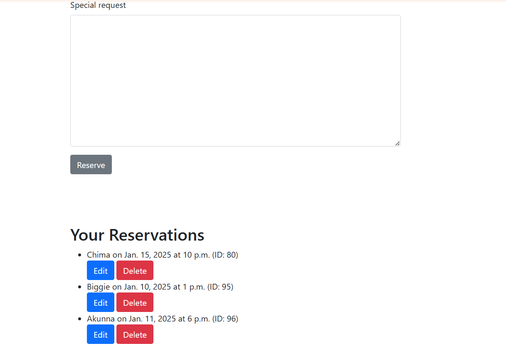

<h1>Sirjay's Cuisine</h1>

 
 

Sirjay's Cuisine is a Full-Stack eat-in reservation site that centrally manages dataset. The site utilizes a number of functionalities including user authentication and CRUD capabilities, to ensure seamless table reservations and management by users and site administrators. Site administrators are able to flexibly modify the menu highlights and also view and manage submitted reservations from the admin page. The intent and essence of this project is to set up a reservation authentication mechanism while also providing role-based access to the site's data or other activities based on the dataset.

<h3>User</h3>
<ul>
<li>As a user, i want to be able to see the restaurants menu highlights on her home page.</li>
<li>As a user, i want to be able to have access to a reservation form.</li>
<li>As a user, i want to be able to make a reservation.</li>
<li>As a user, i want to be able to view and manage my reservations.</li>
</ul>
<h3>Site Owner</h3>
<ul>
<li>As a site owner, i want to be able to flexibly update menu highlights from the admin page.</li>
<li>As a site owner, i want to be able to authenticate users before they can proceed to make reservations.</li>
<li>As a site owner, i want to be able to view and manage all reservations from the admin page.</li>
</ul>
 

<h2>Features</h2>

In achieving the aforementioned project goals, i incorporated the underlisted features.

<h3>1. Agile methodology</h3>

<ul>
<li>I employed GitHub's Label and Milestones functionalities as my Agile tool, to document and implement all User Stories and map them to the project.</li>
</ul>

 
 
 
<ul>
<li>I made use of GitHub's Kanban board functionaly to track the progress and current status of the work progress for every particular iteration.</li>
</ul>

 
 
 
<ul>
<li>I also created as part of the design process, a wireframe of the project's database schema that guided my development of the site.</li>
</ul>

 
 
 
 

<h3>2. Authorisation/Authentication Features</h3>

<ul>
<li>I applied authorisation/authentication features to ensure only registered users are able to make reservations.</li>
</ul>

 
 
 
 
 

<h3>3. CRUD functionality</h3>

<ul>
<li>I created CRUD functionality for users so they are able to create, edit and delete their reservations at will.</li>
</ul>

 
 
 
 

<h3>Future Features</h3>
<ul>
<li>Allow users recieve email notifications for completed reservations and CRUD operations.</li>
</ul>
 

<h2>Technology Used</h2>

<strong>Python+Django</strong>

<ul>
<li>Python+Django programming language is the sole technology used to accomplish this project.</li>
</ul>
 

<strong>HTML</strong>

<ul>
<li>HTML is the standard markup language used for the app's development.</li>
</ul>
 

<strong>CSS</strong>

<ul>
<li>I utilized a little bit of CSS language to style HTML elements.</li>
</ul>
 

<strong>JavaScript</strong>

<ul>
<li>I targeted the delete buttons with some JavaScript code.</li>
</ul>
 

<strong>PostgresSQL</strong>

<ul>
<li>I employed PostgresSQL relational database for the collection and structuring of the project's data.</li>
</ul>
 

<strong>Summernote</strong>

<ul>
<li>I applied the robust Summernote text editor to my admin panel to enhance it with rich text.</li>
</ul>
 

<strong>Whitenoise</strong>

<ul>
<li>I installed the whitenoise package to enable Heroku app serve it's own static fies.</li>
</ul>
 

<strong>AllAuth</strong>

<ul>
<li>I installed and utilized django-allauth authentication package to integrate a secure Python authorisation solution to the project.</li>
</ul>
 

<strong>Cloudinary</strong>

<ul>
<li>Lastly, I installed and set up Cloudinary media storage to allow user-upload of images in the project.</li>
</ul>
 

<h2>Manual Testing</h2>

I manually tested the app to determine it's usability and intuitivity by self as an administrator and also with the help of 5 friends as site users.

<h3>- Administrator testing of admin panel -</h3>
<table>
<tr>
    <th>Test</th>
    <th>Outcome</th>
  </tr>
   <tr>
    <td>Have created models been added to the database?</td>
    <td>Pass</td>
  </tr>
  <tr>
    <th>Test</th>
    <th>Outcome</th>
  </tr>
   <tr>
    <td>Are you ablel to create items for each of these models in the admin page?</td>
    <td>Pass</td>
  </tr>
  <tr>
    <th>Test</th>
    <th>Outcome</th>
  </tr>
   <tr>
    <td>Are you able to perform CRUD operations on datasets from the admin page?</td>
    <td>Pass</td>
  </tr>
</table>
 

<h3>- User testing for menu display -</h3>
<table>
<tr>
    <th>Test</th>
    <th>Outcome</th>
  </tr>
   <tr>
    <td>Are you able to see the displayed menu highlights when on the landing page?</td>
    <td>Pass</td>
  </tr>
</table>
 

<h3>- User testing of account authentication -</h3>
<table>
<tr>
    <th>Test</th>
    <th>Outcome</th>
  </tr>
   <tr>
    <td>Are you able to register to be able to proceed with reservation?</td>
    <td>Pass</td>
  </tr>
  <tr>
    <td>Are you able to log in with your registered user details?</td>
    <td>Pass</td>
  </tr>
</table>
 

<h3>- User testing of reservation form's validity -</h3>
<table>
<tr>
    <th>Test</th>
    <th>Outcome</th>
  </tr>
   <tr>
    <td>Are you able to input data into the reservation form and reserve successfully?</td>
    <td>Pass</td>
  </tr>
  </tr>
   <tr>
    <td>Does your reservation display for you to see after it's sucessfully made?</td>
    <td>Pass</td>
  </tr>
</table>
 

<h3>- User testing of CRUD capabilities -</h3>
<table>
<tr>
    <th>Test</th>
    <th>Outcome</th>
  </tr>
   <tr>
    <td>Are you able to edit your reservation(s)?</td>
    <td>Pass</td>
  </tr>
  <tr>
    <td>Are you able to delete unwanted reservation(s)?</td>
    <td>Pass</td>
  </tr>
</table>
 

<h2>HTML validation</h2>

I tested for HTML validation using the W3C validator by copying and pasting project's herokuapp URL into the URI validator section of W3C validator. I also logged in to be able to copy the rendered HTML from the 'View page source' page and paste into the 'direct input' validate section of the validator.

<h3>- W3C validation -</h3>
<table>
<tr>
    <th>Test</th>
    <th>Outcome</th>
  </tr>
   <tr>
    <td>Was all thrown up errors addressed?</td>
    <td>Yes, save for a last error of a trialing closing paragraph tag which wasn't found upon multiply inspections.</td>
  </tr>
</table>
 

<h2>Backend code validation</h2>

I further ran all python files on the Code Institute (CI) Python Linter checker to check if code meets pep8 requirements.

<h3>- CI Python Linter checker -</h3>
<table>
<tr>
    <th>Test</th>
    <th>Outcome</th>
  </tr>
   <tr>
    <td>Were all errors thrown up by the CI Python Linter checker addressed?</td>
    <td>Pass</td>
  </tr>
</table>
 

<h2>Automated Testing</h2>

I tested the models, views and their GET/POST responses using django's automated tests.

<h3>- Home model/view -</h3>
<table>
<tr>
    <th>Test</th>
    <th>Outcome</th>
  </tr>
   <tr>
    <td>Does the Home model view render home and menu items?</td>
    <td>Pass</td>
  </tr>
</table>
 

<h3>- Reservation form validity -</h3>
<table>
<tr>
    <th>Test</th>
    <th>Outcome</th>
  </tr>
   <tr>
    <td>Does reservation form pass validity test when data is inputted and not inputted?</td>
    <td>Pass</td>
  </tr>
</table>
 

<h3>- Reservation views -</h3>
<table>
<tr>
    <th>Test</th>
    <th>Outcome</th>
  </tr>
   <tr>
    <td>Does the reservation_list view render 'Page' items?</td>
    <td>Pass</td>
  </tr>
<tr>
    <th>Test</th>
    <th>Outcome</th>
  </tr>
   <tr>
    <td>Does the reservation_list view include a reservation form?</td>
    <td>Pass</td>
  </tr>
  <tr>
    <th>Test</th>
    <th>Outcome</th>
  </tr>
   <tr>
    <td>Does the reservation_edit view render correctly with a GET request?</td>
    <td>Pass</td>
  </tr>
  <tr>
    <th>Test</th>
    <th>Outcome</th>
  </tr>
   <tr>
    <td>Does the reservation_delete completes reservation deletion?</td>
    <td>Pass</td>
  </tr>
  <tr>
    <th>Test</th>
    <th>Outcome</th>
  </tr>
   <tr>
    <td>Does a valid POST request create a new reservation?</td>
    <td>Pass</td>
  </tr>
</table>
 

<h2>Bugs</h2>

Solved bugs

<ul>
<li>The most significant bug I encountered was with the inability of the modal's delete button to complete deletion request. I kept getting the - Page not found (404) - error message despite re-confirming severally that the delete URL was properly constructed. After several hours of failed debugging attempts, I was able to identify that the bug was coming from a 'Namespace' I used in constructing the reservation URL in the project-level urls.py file. Once it was removed and reconstructed, the bug was solved.</li>
</ul>
 

<h3>Unfixed Bugs</h3>

No bugs remaining

 

<h2>Deployment</h2>

The project was deployed to Heroku platform using the following steps:

<ul>
<li>Go to Heroku welcome/dashboard page</li>
<li>Click "Create new app"</li>
<li>Fill out the form that pops up with a unique "App name" and select your region -"Europe"</li>
<li>Click "Create app"</li>
<li>On the next page that pops up, click on "Settings"</li>
<li>Scroll down to "Config Vars" and click on "Reveal Config Vars"</li>
<li>Make sure 'CLOUDINAR_URL', DATABASE_URL' and 'SECRET_KEY' variables have been added.</li>
<li>On top of the page, click "Deploy" to select a deployment method </li>
<li>Select GitHub</li>
<li>Click "Connect to GitHub"</li>
<li>Search for GitHub repo name, click "search" and then "connect"</li>
<li>Scroll down and select which deployment option you prefer and "DEPLOY"!</li>
</ul>

<h2>Credits</h2>

Credit

<ul>
<li>The Code Institute Django-Blog project's code was lifted mostly and used to accomplish this project.</li>
<li>Pieces of code for the project was also taken from a number of online materials including, google, youtube channels, https://stackoverflow.com/ and also from the slack network.</li>
</ul>
 
<h2>Acknowledgments</h2>
<h4>Rory Patrick Sheridan</h4>

My mentor whose tutelage and immense assistance I sincerely appreciate and acknowledge.
